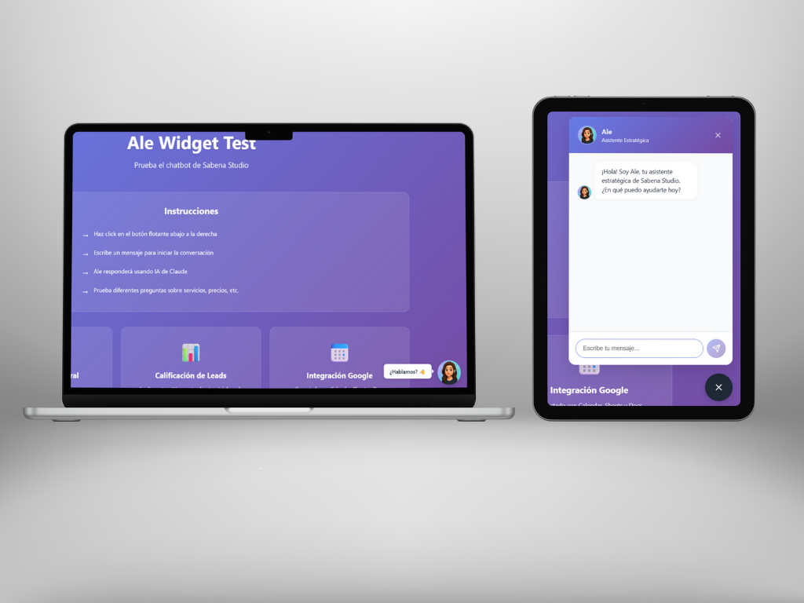
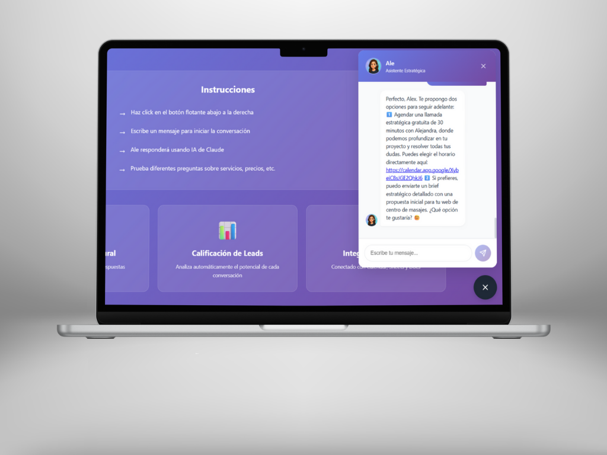
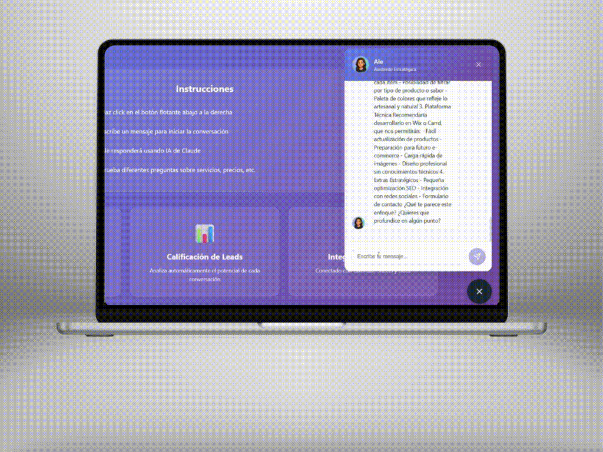

# 🤖 Ale Bot - Asistente Virtual Inteligente con IA

[](https://sabenastudio.com)
[](https://www.anthropic.com/)
[](#)
[](#)
[](#)

> **Asistente virtual estratégico con IA integrada que cualifica leads, agenda reuniones y automatiza la captación de clientes para Sabena Studio.**

---

## 📖 Descripción General

**Ale Bot** es un asistente virtual inteligente desarrollado como parte del ecosistema digital de **Sabena Studio by Alejandra Trinca**. Utiliza **Claude 3.5 Haiku de Anthropic** con **Function Calling** para interactuar de forma natural con visitantes del sitio web, calificar leads automáticamente e integrar información con Google Calendar, Sheets y Gmail.

Este proyecto demuestra la implementación práctica de IA conversacional aplicada a la automatización de procesos comerciales en un entorno web profesional.

---

## 🎯 Propósito del Proyecto

Ale Bot fue diseñado para resolver un desafío clave de los negocios digitales modernos: **convertir visitantes web en leads cualificados sin intervención manual**. 

### Problemas que Resuelve:

- ❌ **Pérdida de leads fuera de horario:** Ale opera 24/7
- ❌ **Tiempo perdido en consultas no cualificadas:** Evalúa automáticamente el nivel de interés
- ❌ **Fricción en el proceso de agendado:** Conecta directamente con Google Calendar
- ❌ **Falta de seguimiento estructurado:** Registra cada interacción en Google Sheets
- ❌ **Documentación manual de briefs:** Genera y envía briefs automáticamente por Gmail

---

## 🏗️ Arquitectura del Sistema

```
┌─────────────────────────────────────────────────────────────┐
│                    ECOSISTEMA ALE BOT                       │
├─────────────────────────────────────────────────────────────┤
│                                                             │
│  ┌──────────────┐          ┌──────────────┐               │
│  │   FRONTEND   │◄────────►│   BACKEND    │               │
│  │  (Vercel)    │   API    │  (Railway)   │               │
│  │              │          │              │               │
│  │ React + Vite │          │ Flask/Python │               │
│  └──────────────┘          └──────┬───────┘               │
│                                   │                        │
│                                   │                        │
│                            ┌──────▼────────┐              │
│                            │  Claude 4.5   │              │
│                            │  Haiku API    │              │
│                            │  (Anthropic)  │              │
│                            └──────┬────────┘              │
│                                   │                        │
│                     ┌─────────────┼─────────────┐         │
│                     │             │             │         │
│              ┌──────▼──────┐ ┌───▼────┐ ┌──────▼──────┐ │
│              │   Google    │ │ Google │ │    Gmail    │ │
│              │  Calendar   │ │ Sheets │ │     API     │ │
│              │             │ │        │ │             │ │
│              │  (Agenda)   │ │(Leads) │ │  (Briefs)   │ │
│              └─────────────┘ └────────┘ └─────────────┘ │
│                                                             │
└─────────────────────────────────────────────────────────────┘
```

---

## ✨ Características Principales

### 🧠 Inteligencia Artificial Avanzada
- **Claude 4.5 Haiku** con Function Calling para ejecución fiable de acciones
- Conversación natural en español adaptada al tono de Sabena Studio
- Evaluación automática de calidad de leads (lead scoring)

### 📅 Integración con Google Calendar
- Consulta de disponibilidad en tiempo real
- Creación automática de eventos de reunión
- Envío de invitaciones por email

### 📊 Gestión Automatizada de Leads
- Registro automático en Google Sheets
- Captura de: nombre, email, empresa, necesidad, presupuesto, urgencia
- Puntuación de calidad del lead

### 📧 Envío de Briefs Estratégicos
- Envío automático de briefs de proyecto vía Gmail API
- Incluye: resumen del proyecto, objetivos, alcance, y próximos pasos
- Personalización según información capturada en la conversación

### 💬 Interfaz Web Moderna
- Widget de chat responsive (mobile/desktop)
- Diseño coherente con la identidad de Sabena Studio
- Minimizable y no invasivo
- Carga asíncrona para no afectar rendimiento del sitio

---

## 📦 Estructura del Proyecto

Este proyecto está dividido en **dos repositorios privados independientes**:

### 1. Backend - `banckend-ale-bot`
**Stack:** Python, Flask, Anthropic SDK, Google APIs  
**Deploy:** Railway  
**Función:** API RESTful que procesa conversaciones y ejecuta function calls

```
banckend-ale-bot/
├── index.py              # Aplicación Flask principal
├── requirements.txt      # Dependencias Python
├── runtime.txt           # Versión de Python para Railway
├── Procfile              # Configuración de despliegue
└── .env.example          # Template de variables de entorno
```

### 2. Frontend - `ale-bot-demo`
**Stack:** React 18, Vite 5, CSS Modules  
**Deploy:** Vercel  
**Función:** Widget embebible de chat conversacional

```
ale-bot-demo/
├── public/
│   └── ale-avatar.png    # Avatar del asistente
├── src/
│   ├── AleChat.jsx       # Componente principal del chat
│   ├── AleChat.css       # Estilos del widget
│   ├── App.jsx           # Aplicación raíz
│   ├── App.css           # Estilos globales
│   └── main.jsx          # Entry point
├── index.html            # HTML base
├── package.json          # Dependencias Node
└── vite.config.js        # Configuración de Vite
```

---

## 🚀 Quick Start

### Prerrequisitos

- Python 3.11+
- Node.js 18+
- Cuenta de Anthropic (Claude API)
- Google Cloud Project con APIs habilitadas:
  - Google Calendar API
  - Google Sheets API
  - Gmail API (OAuth2)

### Instalación

#### 1. Clonar los Repositorios (Privados)

```bash
# Backend
git clone https://github.com/sabenastudio-os/banckend-ale-bot.git
cd banckend-ale-bot

# Frontend (en otra terminal)
git clone https://github.com/sabenastudio-os/ale-bot-demo.git
cd ale-bot-demo
```

#### 2. Configurar Backend

```bash
# Instalar dependencias
pip install -r requirements.txt

# Configurar variables de entorno
cp .env.example .env
# Editar .env con tus credenciales (ver documentación del backend)

# Ejecutar localmente
python index.py
```

#### 3. Configurar Frontend

```bash
# Instalar dependencias
npm install

# Ejecutar en desarrollo
npm run dev
```

#### 4. Acceder a la Aplicación

- **Frontend:** http://localhost:5173
- **Backend API:** http://localhost:8080

---

## 🎨 Capturas de Pantalla

### Widget en Acción

*Vista del widget integrado en el sitio web de Sabena Studio*

### Conversación de Ejemplo

*Ale cualificando un lead y agendando reunión*

---

## 🎥 Demo en Video


*Bot en acción: conversación natural*

---

## 📊 Resultados (MVP)

> **⚠️ Proyecto en fase MVP** - Métricas preliminares basadas en pruebas internas

| Métrica | Valor |
|---------|-------|
| Tiempo de respuesta promedio | ~2-3 segundos |
| Tasa de cualificación de leads | En testing |
| Disponibilidad | 24/7 |
| Idioma soportado | Español |
| Costo operacional estimado | ~$0.05-0.10 por conversación |

---

## 🛣️ Roadmap

### ✅ Completado (v1.0 - MVP)
- [x] Integración con Claude 3.5 Haiku
- [x] Function Calling para Google Calendar
- [x] Registro de leads en Google Sheets
- [x] Envío de briefs por Gmail API
- [x] Widget React embebible
- [x] Deploy en Railway + Vercel

### 🚧 En Desarrollo (v1.1)
- [ ] Soporte multiidioma (inglés)
- [ ] Analytics de conversaciones
- [ ] Mejora de UI/UX del widget
- [ ] Modo offline con fallback

### 🔮 Futuro (v2.0)
- [ ] Integración con WhatsApp Business
- [ ] Panel de administración (dashboard)
- [ ] A/B testing de prompts
- [ ] Lead scoring con machine learning
- [ ] Integración con CRM (HubSpot, Notion)

---

## 🔐 Seguridad y Privacidad

- ✅ **Credenciales encriptadas:** Uso de variables de entorno
- ✅ **HTTPS obligatorio:** Todas las comunicaciones cifradas
- ✅ **CORS configurado:** Solo dominios autorizados
- ✅ **Service Accounts de Google:** Acceso controlado y auditable
- ✅ **Sin almacenamiento de datos sensibles:** Información procesada en tiempo real
- ⚠️ **Revisar compliance GDPR:** Si operas en Europa (pendiente)

---

## 📄 Licencia y Uso

**Este proyecto es propiedad exclusiva de Sabena Studio by Alejandra Trinca. Todos los derechos reservados.**

🚫 **No está permitido:**
- Copiar, modificar o redistribuir el código
- Uso comercial sin autorización expresa
- Despliegue en infraestructura de terceros

✅ **Para consultas sobre:**
- Licenciamiento comercial
- Colaboraciones estratégicas
- Desarrollo personalizado

📧 Contactar a: [sabenastudio@gmail.com](mailto:sabenastudio@gmail.com)

---

## 👩‍💻 Autora

**Alejandra Trinca**  
Framer Expert Certificada | Desarrollo Web con IA | Automatización Inteligente

- 🌐 Web: [sabenastudio.com](https://sabenastudio.com)
- 📧 Email: sabenastudio@gmail.com
- 💼 LinkedIn: [linkedin.com/in/alejandra-trinca](https://linkedin.com/in/alejandra-trinca)

---

## 🙏 Agradecimientos

- [Anthropic](https://www.anthropic.com/) por Claude AI
- [Railway](https://railway.app/) por el hosting del backend
- [Vercel](https://vercel.com/) por el hosting del frontend
- [Google Cloud](https://cloud.google.com/) por las APIs de productividad

---

## 📚 Documentación Adicional

- 📘 Ver README del Backend (en repositorio `banckend-ale-bot`)
- 📗 Ver README del Frontend (en repositorio `ale-bot-demo`)

---

<div align="center">

**Construido con 💜 por Sabena Studio**

*Transformando webs en ecosistemas de crecimiento con IA y automatización*

[🌐 Visitar Sabena Studio](https://sabenastudio.com) | [📧 Contacto](mailto:sabenastudio@gmail.com) | [📅 Agendar Consulta](https://calendar.app.google/XybeiC8sJGE2QhkJ6)

</div>
